This is a college Application which runs on Android platforms. This Application Provides Features like Bus Tracking , Feed Section , Fee Tracking , Notification on Events and Announcements.The main purpose of this application is to provide closest location of the student’s respective buses in Google Maps and Track the payment of bus fee in order to manage their day easily. This application may be widely used by the college students since Android smart phones have become common and affordable for all. It is a real time system as the current location of the bus is updated every moment in the form of latitude and longitude which is received by the students through their application on Google maps. 

The proposed methodology consists of three major modules such as Driver, Student and Admin. The proposed system allows the user to find exact location of the bus , Track fees , Manage Bus ID , Track Upcoming Events and Socialize. The bus routes are displayed in the user interface so that students can select the bus route through which they travel. The position of the bus is displayed in the google map. Depending on the information like distance and position displayed on google map, user can plan and start accordingly

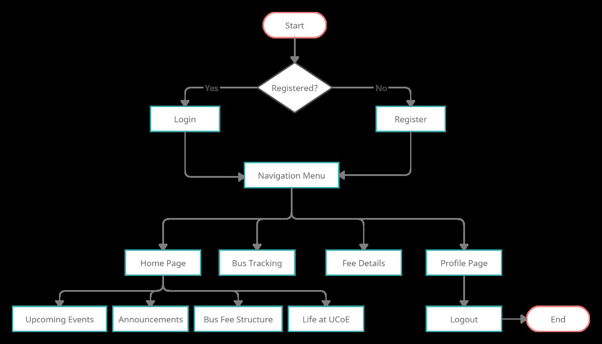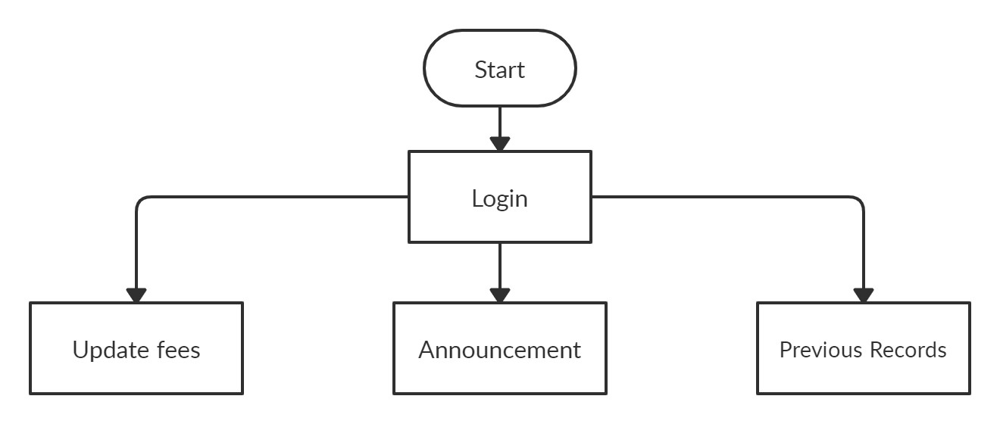
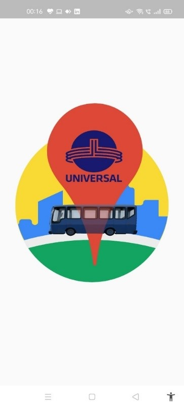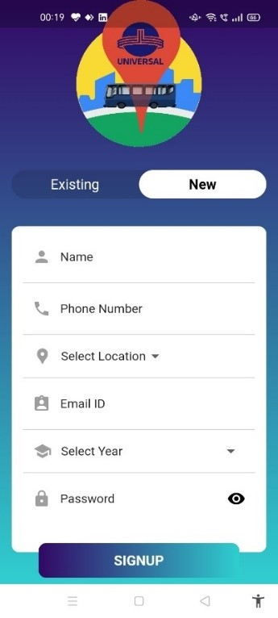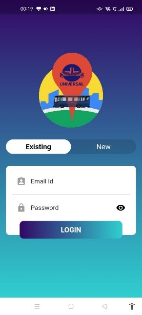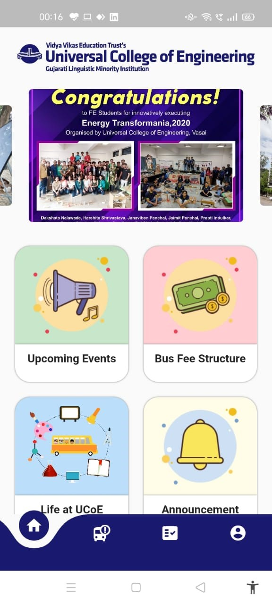
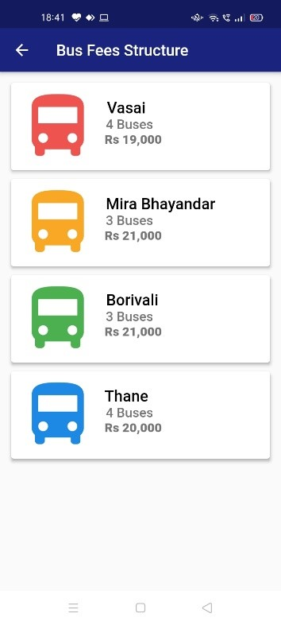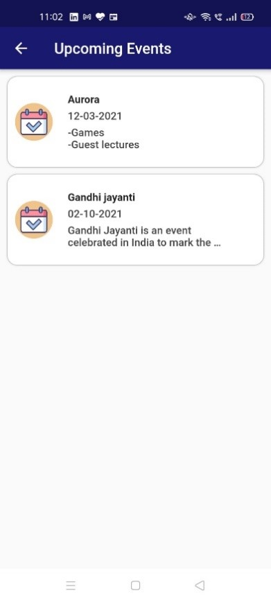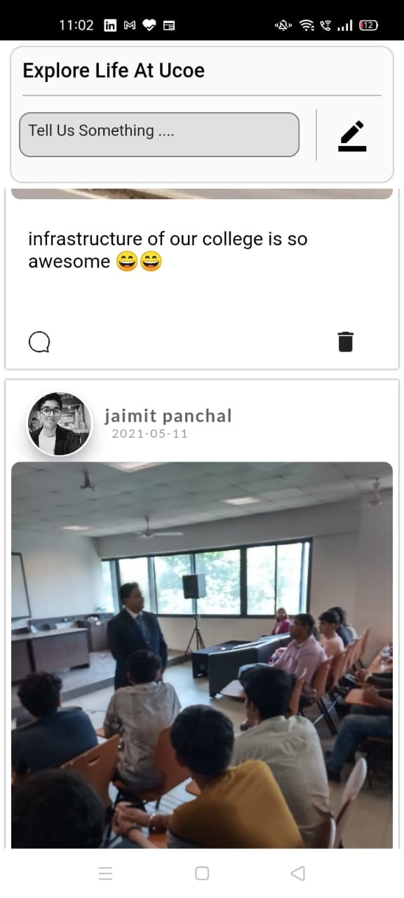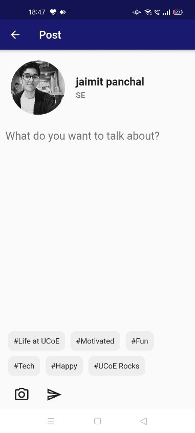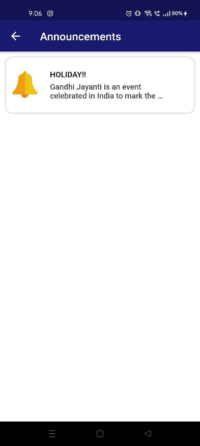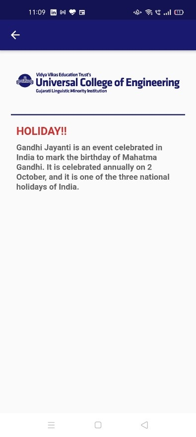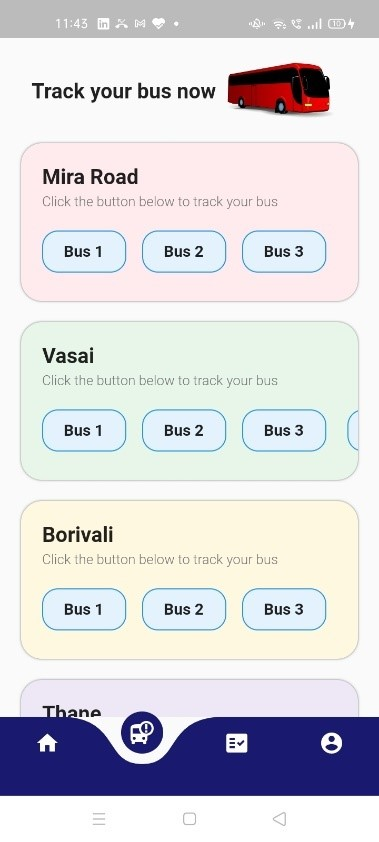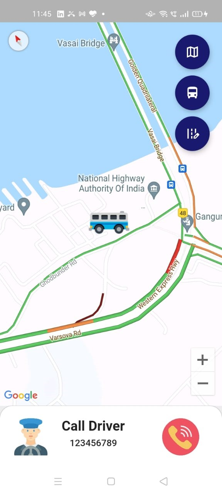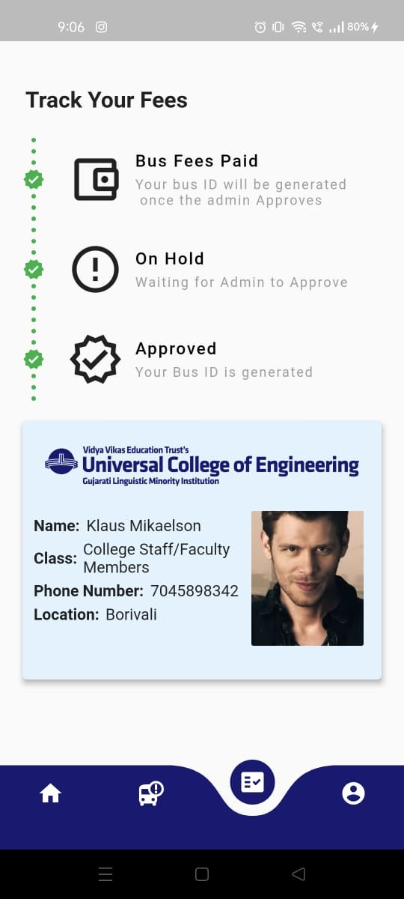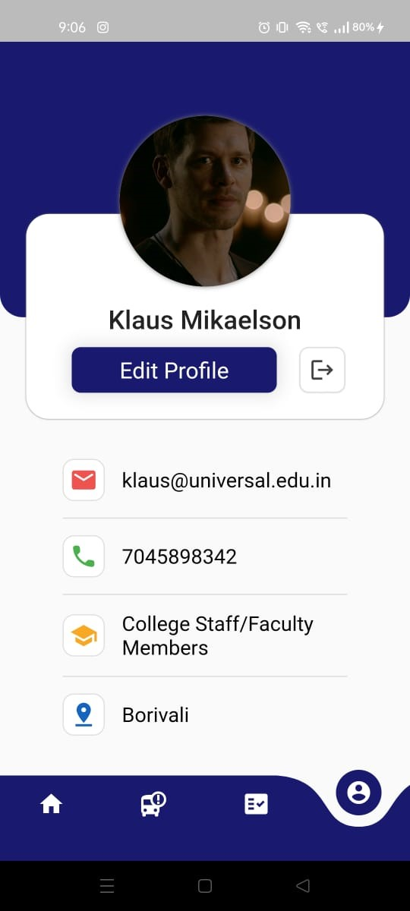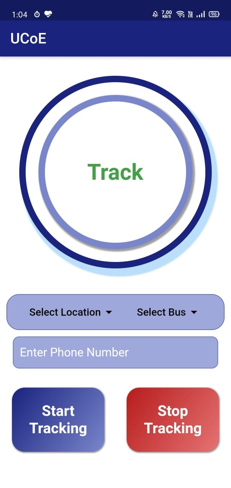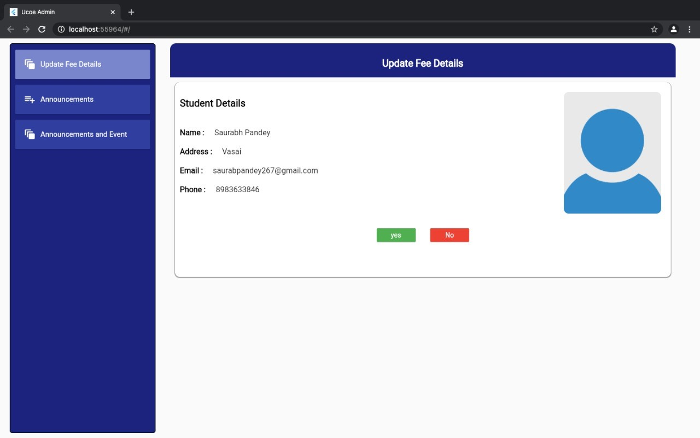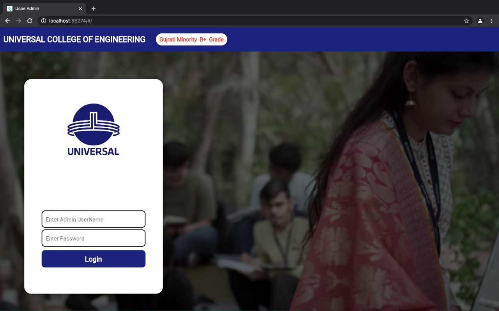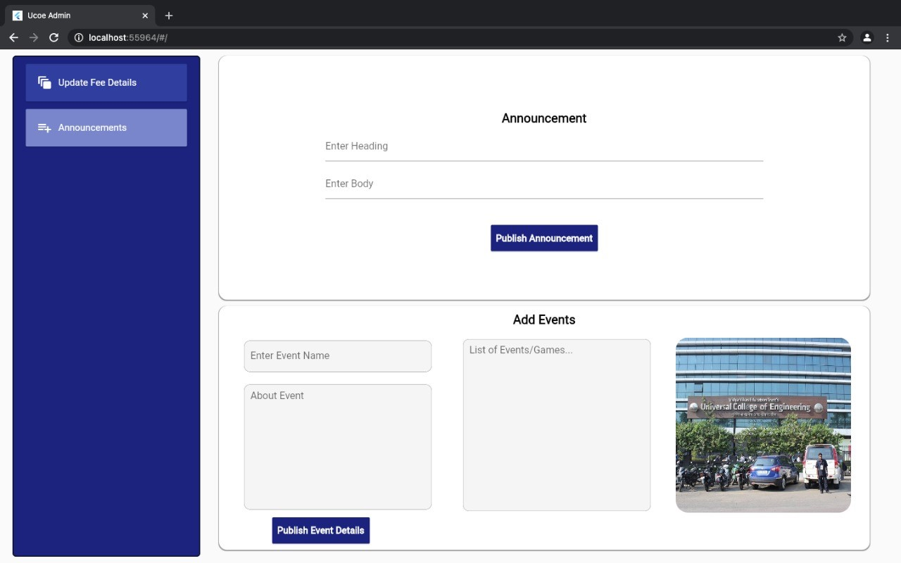
